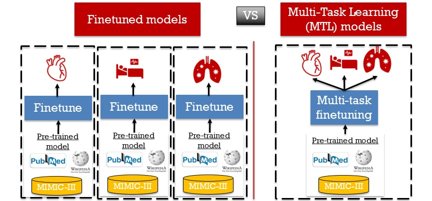

This package demonstrates several strategies for predicting postoperative risks from clinical notes, including 
1. direct inference with a fine-tuned model
2. semi-supervised approaches
3. Our novel multi-task learning approach that allows a single model to predict multiple postoperative outcomes.

It is designed for the American College of Surgeons (ACS) workshop
*AI for Clinicians and Surgeons: A Hands-On Introduction Across the Care Continuum*.

---

## Installation

```bash
pip install demo-clinical-notes-risk-prediction
```

Because `torch` CUDA wheels aren't hosted on PyPI, install PyTorch first matching your GPU's CUDA version, then install this package. For example, on a machine with CUDA 11.8 drivers:

```bash
pip install torch==2.1.2 --index-url https://download.pytorch.org/whl/cu118
pip install demo-clinical-notes-risk-prediction
```

**Python version**: 3.9–3.11 (tested on 3.11).

---

## Quick example

```python
import pandas as pd
from MultiTaskLearningPrediction import mtl_finetune, get_postoperative_outcome_scores

df = pd.read_csv("my_clinical_data.csv")
# df columns: "text", "Outcome_1", "Outcome_2", "Outcome_3", "Outcome_4"

# 1. Fine-tune
mtl_finetune(
    df,
    text_col="text",
    outcome_cols=["Outcome_1", "Outcome_2", "Outcome_3", "Outcome_4"],
    output_dir="my_finetuned_model",
)

# 2. Score a new scenario
scores = get_postoperative_outcome_scores(
    "my_finetuned_model",
    "total knee arthroplasty"
)
# {'Outcome_1': 0.12, 'Outcome_2': 0.28, 'Outcome_3': 0.04, 'Outcome_4': 0.39}
```

---

## API reference

### `MultiTaskLearningPrediction`

Multi-Task Learning (MTL) allows you to train a single versatile model capable of predicting multiple postoperative outcomes from the same clinical notes. Unlike traditional finetuning strategies — where you'd need to train a single model for each outcome — MTL allows you to create a model capable of simultaneously predicting multiple risks — analogous to foundation models. 




**Example**  

```python
mtl_finetune(
    df,
    text_col="clincal_notes",
    outcome_cols=["death_30d", "dvt", "pneumonia", "aki", "AUR", "PE"],
    output_dir="my_run",
    training_configs={
        "num_train_epochs": 3,
        "per_device_train_batch_size": 16,
        "evaluation_strategy": "steps",
        "eval_steps": 100,
        "logging_steps": 100,     
        "learning_rate": 2e-5
        }
)
```

Fine-tune Bio+ClinicalBERT on MLM jointly with one binary classification head per outcome.

**Parameters**

- `df` (`pandas.DataFrame`, *required*): Must contain `text_col` and all `outcome_cols`.  
- `text_col` (`str`, *required*): Name of the free-text column.  
- `outcome_cols` (`list[str]`, *required*): Names of binary (0/1) outcome columns. One auxiliary head is trained per outcome. Rows with NaN in a given outcome are dropped for that outcome's task but used for the others.   
- `output_dir` (`str`, default `"mtl_finetuned"`): Directory to save the fine-tuned model, tokenizer, and metadata. Also used as the HuggingFace Trainer `output_dir` for checkpoints and logs.  
- `base_model` (`str`, default `"emilyalsentzer/Bio_ClinicalBERT"`): HuggingFace model id to start from. Any BERT-architecture model should work.  
- `max_length` (`int`, default `512`): Token sequence length for tokenization.  
- `lambda_constant` (`float`, default `2`): Weight on the auxiliary (per-outcome BCE) loss relative to MLM loss. Total loss = MLM + λ · mean(per-task BCE).   
- `val_fraction` (`float`, default `1/8`): Fraction of `df` held out for validation during training.  
- `training_configs` (`dict | None`, default `None`): Any keyword arguments accepted by `transformers.TrainingArguments`. User-provided values override the defaults below.  Default `training_configs` is `{"num_train_epochs": 5, "per_device_train_batch_size": 24, "per_device_eval_batch_size": 24, "learning_rate": 1e-5, "warmup_ratio": 0.06, "weight_decay": 1e-3, "logging_steps": 1000 "save_strategy": "epoch", "seed": 42,}`


**Returns**

`str` — the `output_dir` path. After training, this directory contains:

- `pytorch_model.bin` (or `model.safetensors`) — model weights
- `config.json` — model architecture config
- `tokenizer.json`, `vocab.txt`, `tokenizer_config.json`, `special_tokens_map.json` — tokenizer
- `mtl_metadata.json` — records `outcome_cols`, `text_col`, `max_length`, `base_model`, `lambda_constant`, `num_tasks` so inference can recover them automatically
- `checkpoint-*` — per-epoch training checkpoints (can be deleted after training)
- `logs/` — TensorBoard-compatible training logs


---

### `get_postoperative_outcome_scores`


Score a text scenario (or list of scenarios) against each auxiliary head of a fine-tuned MTL model.

**Example**

```python
get_postoperative_outcome_scores(
    model_name,
    text,
    outcomes=["death_30d", "dvt", "pneumonia", "aki", "AUR", "PE"],
)
```


**Parameters**

| Name | Type | Default | Description |
|---|---|---|---|
| `model_name` | `str` | *required* | Path to a directory saved by `mtl_finetune`. |
| `text` | `str \| list[str]` | *required* | One scenario string, or a list of them. Determines the shape of the return value. |
| `outcomes` | `list[str] \| None` | `None` | Which outcomes to score. Defaults to all outcomes the model was trained on (recovered from `mtl_metadata.json`). Pass a subset to score only some. Names must match those used in `mtl_finetune`. |
| `max_length` | `int \| None` | `None` | Token sequence length. Defaults to the value used during fine-tuning (recovered from metadata), else `512`. |
| `device` | `str \| None` | `None` | `"cuda"`, `"cpu"`, or `None` to auto-detect. |

**Returns**

- `dict[str, float]` when `text` is a string — maps each outcome name to a probability in `[0, 1]`.
- `list[dict[str, float]]` when `text` is a list — one dict per input, in the same order.


